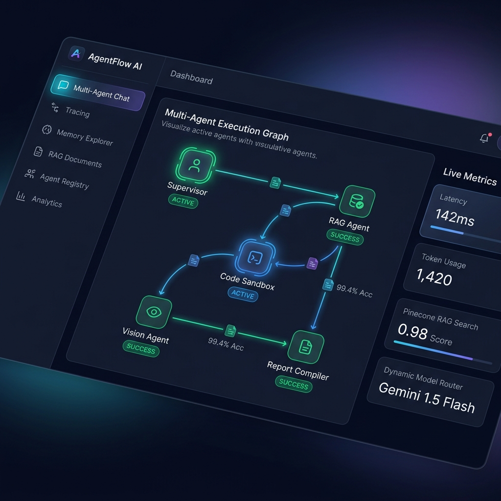
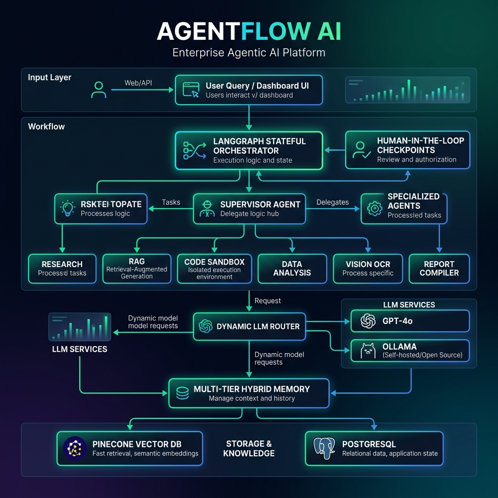

# AgentFlow AI: Production-Grade Agentic AI Platform

[](https://www.python.org/)
[](https://fastapi.tiangolo.com/)
[](https://langchain-ai.github.io/langgraph/)
[](https://www.pinecone.io/)
[](https://reactjs.org/)
[](https://www.typescriptlang.org/)

> **Enterprise-grade Multi-Agent Orchestration Platform** built with **LangGraph**, **FastAPI**, **Pinecone Vector DB**, **Async SQLAlchemy**, and a modern **React / TypeScript Dashboard**. Features 7 specialized agents, 12 secure tool APIs, dynamic LLM routing, hybrid multi-tier memory, real-time execution tracing, and an AI evaluation suite.

---

## 📸 Dashboard & Platform Visuals

### System Dashboard Overview


### End-to-End System Architecture


---

## 🌟 Key Highlights & Features

- **LangGraph Stateful Orchestrator**: Multi-agent task decomposition, sub-task planning, human-in-the-loop (HITL) approval checkpoints, state resume, and automatic retries.
- **7 Specialized AI Agents**:
  1. 🧠 **Supervisor Agent**: Task planner, sub-step delegator, and final output synthesizer.
  2. 🔍 **Research Agent**: Deep web search, fact extraction, and document crawling.
  3. 📚 **RAG Agent**: Pinecone vector similarity search, document chunk re-ranking, and grounded QA.
  4. 💻 **Code Agent**: Python/Bash code generation, syntax validation, and sandboxed code execution.
  5. 📊 **Data Analysis Agent**: CSV/Excel analytics, pandas transformations, SQL queries, and chart formatting.
  6. 👁️ **Vision Agent**: Optical Character Recognition (OCR), document parsing, and scene understanding.
  7. 📝 **Report Agent**: Structured Markdown, PDF generation, and executive report compilation.
- **12 Enterprise Tool APIs**:
  - Web Search (`duckduckgo-search`), Safe Math Calculator, Weather Lookup, SQL Database Query, Filesystem Management, Python Code Sandbox, Document Parser, Email Dispatcher, PDF Generator, OCR Reader, Vector Search, and Report Compiler.
- **Dynamic Model Router**: Classifies incoming query intent and routes to Gemini 1.5/3.6 Flash (speed & cost efficiency), GPT-4o (complex reasoning), Gemini Vision (images), or Ollama (offline privacy).
- **Multi-Tier Hybrid Memory Architecture**:
  - **Transient State**: LangGraph workflow state buffer.
  - **Long-Term Memory**: Key-value operational context stored in PostgreSQL/SQLite.
  - **Semantic Memory**: High-dimensional vector embeddings stored in Pinecone DB.
  - **User Profile Memory**: Domain persona and permanent preference facts.
  - **Conversation History**: Context window buffer.
- **Real-Time Observability & Tracing**: Microsecond execution latency tracking, token count estimation, estimated cost ($USD), tool call logs, retry telemetry, and agent path visualizer.
- **AI Evaluation Suite**: Quantitative benchmarks for Answer Quality, Retrieval Groundedness, Hallucination Score, and Tool Execution Accuracy.

---

## 📁 Repository Structure

```
AgentForge AI/
├── backend/
│   ├── agents/          # 7 Specialized Agents + Base Agent class
│   ├── api/             # FastAPI REST Routers (auth, chat, agents, docs, memory, tracing, eval, settings)
│   ├── core/            # App Configuration (Pydantic Settings), Security, Logger
│   ├── database/        # Async SQLAlchemy session management & DB seeder
│   ├── evaluation/      # Hallucination, Groundedness & Accuracy evaluator
│   ├── memory/          # Multi-tier Memory Manager & Pinecone DB client wrapper
│   ├── models/          # SQLAlchemy Domain Models
│   ├── models_router/   # Dynamic LLM Router (Gemini / OpenAI / Ollama)
│   ├── orchestrator/    # LangGraph StateGraph & Execution Engine
│   ├── repositories/    # Database Repository pattern implementation
│   ├── schemas/         # Pydantic validation schemas
│   ├── security/        # JWT Authentication & RBAC dependencies
│   ├── services/        # RAG Service & 12 Enterprise Tool APIs
│   └── tracing/         # Microsecond Execution Tracer & Cost engine
│
├── frontend/
│   ├── src/
│   │   ├── components/  # Layout, Navigation, Sidebar, Metric Cards
│   │   ├── pages/       # 11 Interactive Dashboard pages (Chat, Tracing, RAG, Memory, Agents)
│   │   ├── services/    # Axios REST API Client
│   │   └── types.ts     # TypeScript type definitions
│   ├── index.html
│   └── vite.config.ts
│
├── docs/
│   ├── images/          # Dashboard screenshots & Architecture diagrams
│   ├── ARCHITECTURE.md
│   ├── API_DOCUMENTATION.md
│   └── INSTALLATION.md
│
├── .env.example         # Template for environment variables and secrets
├── .gitignore            # Git exclusion rules for venvs, DBs, and local caches
├── docker-compose.yml   # Multi-container orchestration (Backend + Postgres + Frontend)
└── README.md
```

---

## 🛠️ Quick Start Guide

### Prerequisites
- Python 3.10+
- Node.js 18+
- (Optional) Docker & Docker Compose

---

### 1. Backend Setup

```bash
# Navigate to the backend directory
cd backend

# Create and activate a Python virtual environment
python -m venv venv
# On Windows (PowerShell):
venv\Scripts\Activate.ps1
# On Linux/macOS:
source venv/bin/activate

# Install dependencies
pip install -r requirements.txt

# Copy environment template
cp ../.env.example .env

# Start the FastAPI development server
python -m backend.main
```
> The API server will start at `http://localhost:8000`. You can inspect the interactive OpenAPI docs at `http://localhost:8000/docs`.

---

### 2. Frontend Setup

```bash
# Navigate to the frontend directory
cd frontend

# Install Node dependencies
npm install

# Start the Vite development server
npm run dev
```
> The React dashboard will be available at `http://localhost:5173`.

---

### 3. Default Credentials

For initial login to the platform dashboard:
- **Email**: `admin@agentflow.ai`
- **Password**: `admin123!`

---

## ⚙️ Environment Variables

Configure your API keys in `.env` (refer to `.env.example`):

```env
# LLM Provider API Keys
GEMINI_API_KEY=your_gemini_api_key_here
OPENAI_API_KEY=your_openai_api_key_here
OLLAMA_BASE_URL=http://localhost:11434

# Vector DB (Pinecone)
PINECONE_API_KEY=your_pinecone_api_key_here
PINECONE_INDEX_NAME=agentflow

# Security & Auth
SECRET_KEY=agentflow_super_secret_key_change_in_production_32bytes_min

# Database
POSTGRES_USER=agentflow_user
POSTGRES_PASSWORD=agentflow_password
POSTGRES_DB=agentflow_db
```

---

## 🧪 Running Tests

To execute backend integration and unit tests:

```bash
cd backend
pytest
```

---

## 📄 License

This project is open-source under the MIT License.
