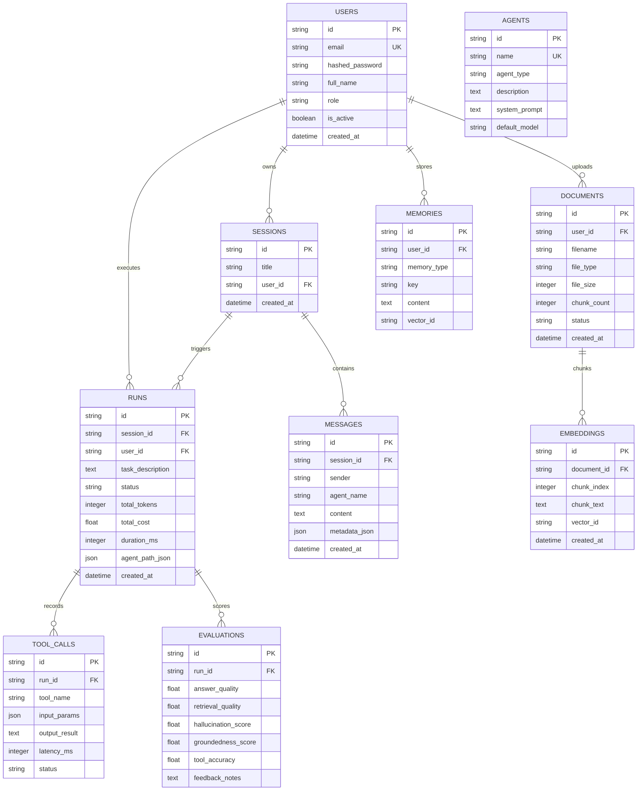

# AgentFlow AI - Database Schema Documentation

```mermaid
erDiagram
    USERS ||--o{ SESSIONS : owns
    USERS ||--o{ DOCUMENTS : uploads
    USERS ||--o{ RUNS : executes
    USERS ||--o{ MEMORIES : stores
    SESSIONS ||--o{ MESSAGES : contains
    SESSIONS ||--o{ RUNS : triggers
    DOCUMENTS ||--o{ EMBEDDINGS : chunks
    RUNS ||--o{ TOOL_CALLS : records
    RUNS ||--o{ EVALUATIONS : scores

    USERS {
        string id PK
        string email UK
        string hashed_password
        string full_name
        string role
        boolean is_active
        datetime created_at
    }

    SESSIONS {
        string id PK
        string title
        string user_id FK
        datetime created_at
    }

    MESSAGES {
        string id PK
        string session_id FK
        string sender
        string agent_name
        text content
        json metadata_json
        datetime created_at
    }

    DOCUMENTS {
        string id PK
        string user_id FK
        string filename
        string file_type
        integer file_size
        integer chunk_count
        string status
        datetime created_at
    }

    EMBEDDINGS {
        string id PK
        string document_id FK
        integer chunk_index
        text chunk_text
        string vector_id
        datetime created_at
    }

    AGENTS {
        string id PK
        string name UK
        string agent_type
        text description
        text system_prompt
        string default_model
    }

    RUNS {
        string id PK
        string session_id FK
        string user_id FK
        text task_description
        string status
        integer total_tokens
        float total_cost
        integer duration_ms
        json agent_path_json
        datetime created_at
    }

    TOOL_CALLS {
        string id PK
        string run_id FK
        string tool_name
        json input_params
        text output_result
        integer latency_ms
        string status
    }

    EVALUATIONS {
        string id PK
        string run_id FK
        float answer_quality
        float retrieval_quality
        float hallucination_score
        float groundedness_score
        float tool_accuracy
        text feedback_notes
    }

    MEMORIES {
        string id PK
        string user_id FK
        string memory_type
        string key
        text content
        string vector_id
    }
```
